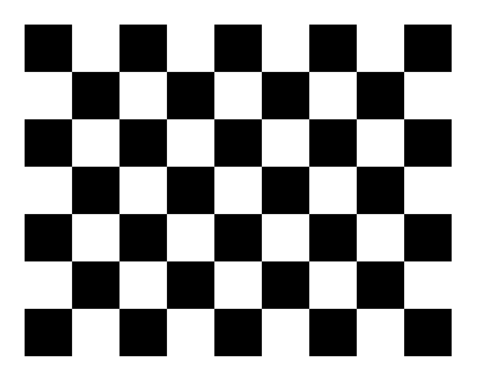

# Usb_cam-Camera_calibration


Firstly according to the ROS Wiki, you should install the ROS you need

## To build this usb_cam in the file

```console
mkdir -p ~/catkin-ws/src

cd ~/catkin-ws/src

git clone https://github.com/ros-drivers/usb_cam.git 

cd ..

catkin build -DPYTHON_EXECUTABLE=/usr/bin/python3 -DPYTHON_INCLUDE_DIR=/usr/include/python3.8

source ~/catkin-ws/devel/setup.bash
```

Please note the DPYTHON_INCLUDE_DIR should be the python i nyour include file

## How to calibrate the monocular camera

1. Prepare a image as shown in 
2. 
3. Then use the bash:

```console
rosrun rosrun usb_cam usb_cam_node
rosrun camera_calibration cameracalibrator.py --size 7x5 --square 0.028 image:=/usb_cam/image_raw camera:=/usb_cam
```
4.Try to move the image close to your usb_cam as close as possible, then when te camera collect enough data, you can calibrate and save your results in the zip file in /tmp/calibration.zip

